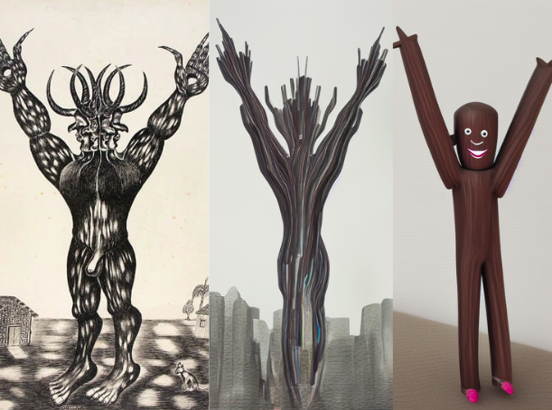
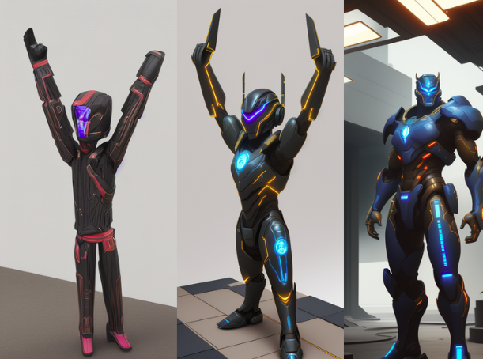
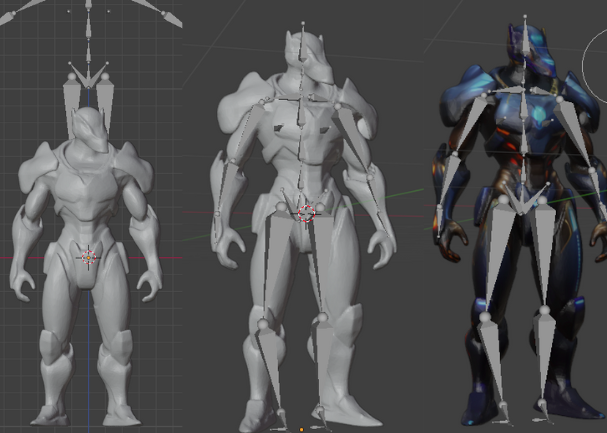
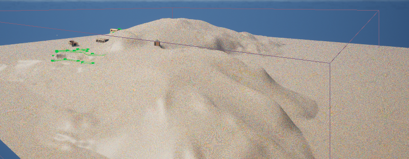
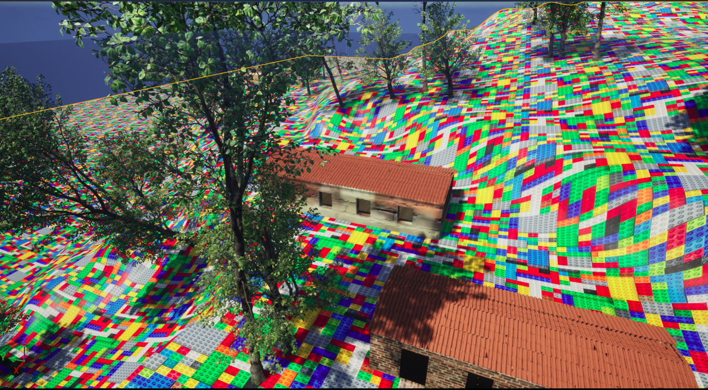
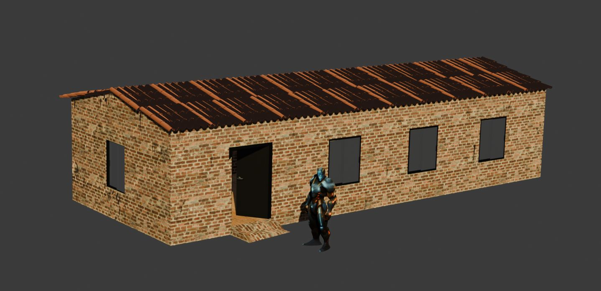
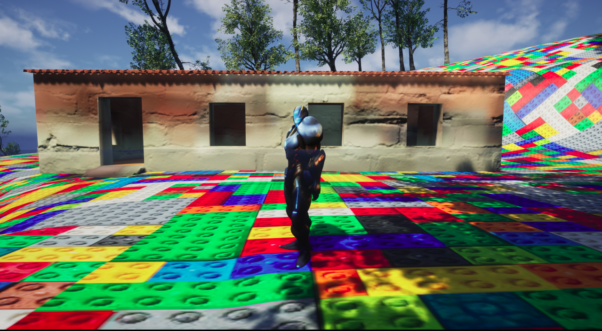

# Projeto de Modelagem 3D e Ambiente Interativo

##  Alunos
- Eduardo Achar - 23102448  
- Victoria Rodrigues Veloso - 23100460  


## Ideia Geral

O projeto consiste no desenvolvimento de um personagem 3D e de um ambiente interativo ambientado em uma ilha personalizada. Foram empregadas ferramentas como Blender, Unreal Engine e inteligência artificial generativa, com ênfase na criatividade, nos aspectos técnicos e na integração entre diferentes tecnologias.

## Criação do Personagem com IA

A etapa inicial da modelagem contou com a utilização da IA generativa ComfyUI, com o objetivo de produzir referências visuais para a construção do modelo 3D.

 <p align="center"><strong>Protótipos iniciais via IA</strong></p>
Após algumas iterações e ajustes nos prompts, foi possível alcançar um visual mais próximo do que desejado, que serviu como referência final para a modelagem.

 <p align="center"><strong>Conceito final via IA</strong></p>


## Personagem
A modelagem tridimensional do personagem foi desenvolvida no Blender, abrangendo a criação da malha, o processo de rigging e a exportação de animações.

 <p align="center"><strong>Processo de rigging</strong></p>

### Animações:

[Demonstração do personagem animado](https://drive.google.com/file/d/1UkjmjNb1LA9SQiFO4_uER_uDhBA1ABAz/view?usp=sharing)

## Construção do Ambiente
### Ilha
A ilha foi criada com base em dados geográficos reais, importados via BlenderGIS. A textura do terreno foi gerada com IA (Leonardo.Ai) no estilo LEGO, depois ajustada no Unreal.

 <p align="center"><strong>Terreno modelado no Blender</strong></p>  <p align="center"><strong>Ilha texturizada no Unreal</strong></p>

### Casa
Uma casa foi modelada para compor o cenário da ilha. Entre os principais desafios enfrentados, destaca-se a configuração adequada das colisões, permitindo a navegação do personagem no interior da construção.

 <p align="center"><strong>Casa, personagem e luzes</strong></p>  <p align="center"><strong>Ambiente final com iluminação</strong></p>


## Controles do Jogador

Para explorar a ilha personalizada e interagir com as funcionalidades disponíveis, utilize os seguintes comandos:

- `W` - Andar para frente  
- `S` - Andar para trás  
- `A` - Andar para a esquerda  
- `D` - Andar para a direita  
- `Espace` - Pular  
- `B` - Dançar break


##  Como executar o projeto

Para executar este projeto, é necessário ter o **Unreal Engine instalado** na sua máquina e configurado corretamente.

#### 🔧 Comandos disponíveis

* **Abrir o projeto no Unreal Editor:**

  ```bash
  make run
  ```

* **Gerar o executável do jogo:**

  ```bash
  make build
  ```

* **Remover os arquivos de build gerados:**

  ```bash
  make clean
  ```
