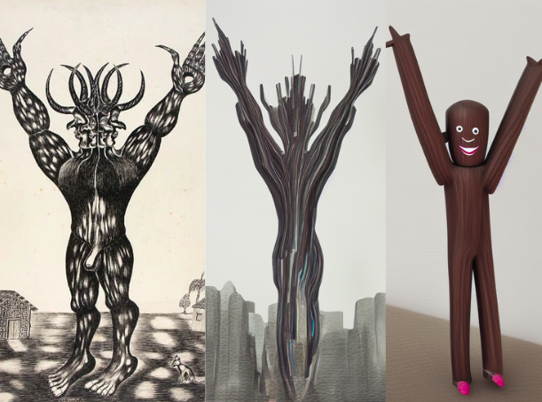
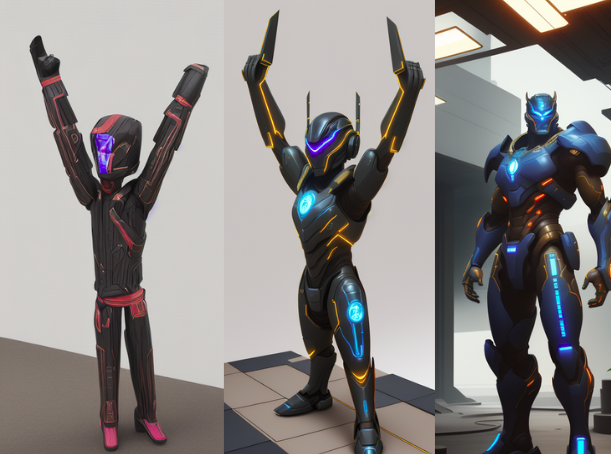
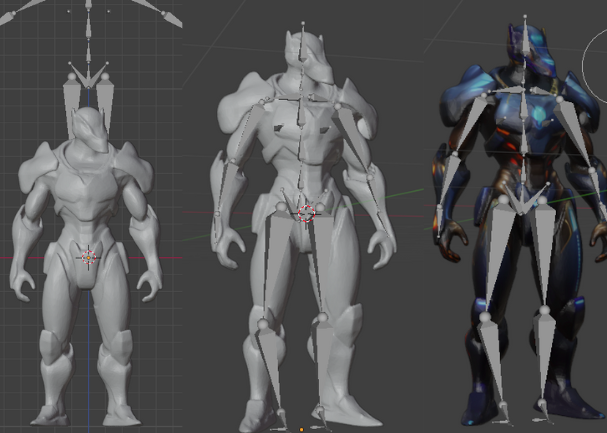

# Modelagem 

##  Alunos
- Eduardo Achar - 23102448  
- Victoria Rodrigues Veloso - 23100460  

## Desenvolvimento da modelagem

Durante o processo de modelagem do personagem, foram adotadas abordagens iterativas com o auxílio de ferramentas baseadas em inteligência artificial generativa. Inicialmente, utilizamos o ComfyUI, um ambiente gráfico para workflows de geração de imagens, com o objetivo de criar protótipos visuais que serviriam como referência para a modelagem 3D.

Através da IA generativa, diversos prototótipos intermediários foram produzidos a partir de prompts descritivos. No entanto, os primeiros resultados não estavam alinhados com o que idealizávamos para o personagem.

  

Após ajustes nos prompts e no fluxo de trabalho dentro do ComfyUI, conseguimos resultados mais satisfatórios, que guiaram melhor o processo criativo e técnico da modelagem. O refinamento progressivo resultou no conceito visual final utilizado para a modelagem 3D.

  

## Etapas da Modelagem 3D

A modelagem foi realizada no software Blender, e, ao longo do processo, enfrentamos uma série de desafios técnicos e conceituais, especialmente por ser um ambiente relativamente novo para nós. Entre as principais dificuldades enfrentadas, destacam-se:

- Familiarização com o Blender: Por ser um software robusto, com muitos recursos e uma interface complexa, houve uma curva de aprendizado significativa até que conseguíssemos realizar operações básicas de modelagem.

- Rigging (inserção do esqueleto): Um dos momentos mais desafiadores foi o processo de rigging, ou seja, a inserção e ajuste do esqueleto no modelo. Inicialmente, os ossos criados não se alinhavam corretamente à malha do personagem. A estrutura óssea não se mantinha fixa ao modelo, o que inviabilizava a criação de animações realistas.

  

- Salvamento e teste de animações: Após finalmente conseguir aplicar o esqueleto corretamente, ainda houve dificuldades para salvar e reproduzir animações, especialmente no que diz respeito ao armazenamento correto dos keyframes e à exportação para outros formatos (como .fbx ou .glb), mantendo as animações funcionais.

